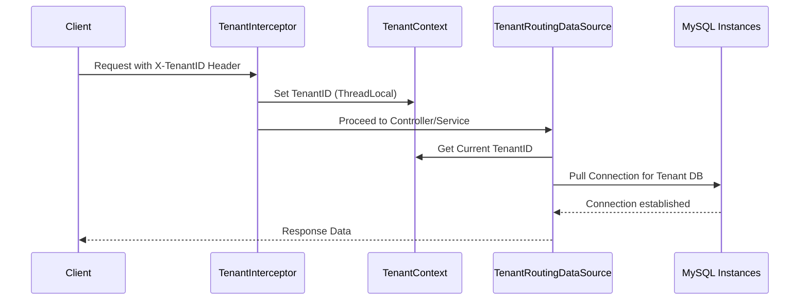

#  Multi-Tenant Data Source Router
## Project "Resume" & Achievements
This project demonstrates a high-level implementation of **Database-per-Tenant** multi-tenancy in a Spring Boot environment. It is engineered as a reusable **Custom Spring Boot Starter**, allowing any application to easily adopt multi-tenant capabilities by merely adding the dependency and minimal configuration.

### Technical Highlights:
- **Dynamic Routing**: Leveraged `AbstractRoutingDataSource` to switch databases at runtime based on the request context.
- **Context Management**: Implemented a thread-safe `TenantContext` using `ThreadLocal` to ensure data isolation across concurrent requests.
- **Auto-Configuration**: Built a robust `AutoConfiguration` module that provides seamless integration for consuming applications.
- **Scalable Infrastructure**: Orchestrated a containerized MySQL environment using **Docker Compose** with automated database provisioning scripts.

---

##  Architecture Flow
The following diagram illustrates how the application identifies the tenant and routes the database connection:



---

##  Tech Stack
- **Framework**: Spring Boot 3.2.0
- **Language**: Java 17
- **Database**: MySQL 8.0
- **Build Tool**: Maven
- **Containerization**: Docker & Docker Compose
- **Context Logic**: Spring AOP / Interceptors

---

##  Getting Started

### 1. Clone the Repository
Open your terminal and run:
```bash
git clone https://github.com/sirinethikonda/Custom-Spring-Boot-Starter-for-Multi-Tenant-Data-Source-Routing-Man.git
cd Custom-Spring-Boot-Starter-for-Multi-Tenant-Data-Source-Routing-Man
```

### 2. Prerequisites
Ensure you have the following installed:
- [Java 17+](https://adoptium.net/)
- [Maven 3.8+](https://maven.apache.org/download.cgi)
- [Docker & Docker Desktop](https://www.docker.com/products/docker-desktop/)

### 3. Setup Infrastructure
Launch the MySQL database environment using Docker Compose. This will automatically set up the tenant-specific databases (`tenant1_db`, `tenant2_db`, `tenant3_db`).
```bash
docker-compose up -d
```

### 4. Build and Run
Build the entire multi-module project and run the demo application:
```bash
mvn clean install
cd demo-application
mvn spring-boot:run
```

---

##  API Reference

### Tenant Identification
All requests **MUST** include the following header to specify which tenant database to access:

| Header | Description | Possible Values |
| :--- | :--- | :--- |
| `X-TenantID` | The unique identifier for the tenant | `tenant1`, `tenant2`, `tenant3` |

### Endpoints

#### 1. Create User
`POST /api/users`
```json
{
    "name": "John Doe",
    "email": "john.doe@example.com"
}
```

#### 2. Get All Users
`GET /api/users`
*Returns a list of users existing in the specific tenant's database.*

#### 3. Get User by ID
`GET /api/users/{id}`

---

## Project Structure
- `multitenancy-spring-boot-starter`: The core library containing routing logic and auto-configuration.
- `demo-application`: A sample Spring Boot app demonstrating the usage of the starter.
- `db-init`: Contains the `init-tenant-dbs.sh` script for database provisioning.

---

## Contribution
Contributions are welcome! If you find a bug or have a feature request, please open an issue or submit a pull request.

---

##  License
Distrubuted under the MIT License. See `LICENSE` for more information.

---
